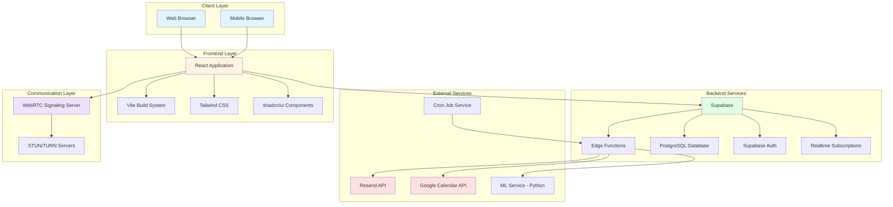
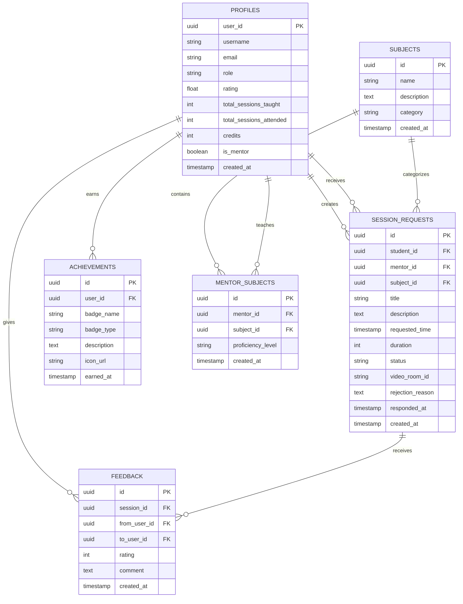
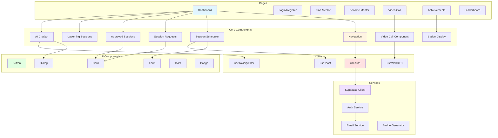
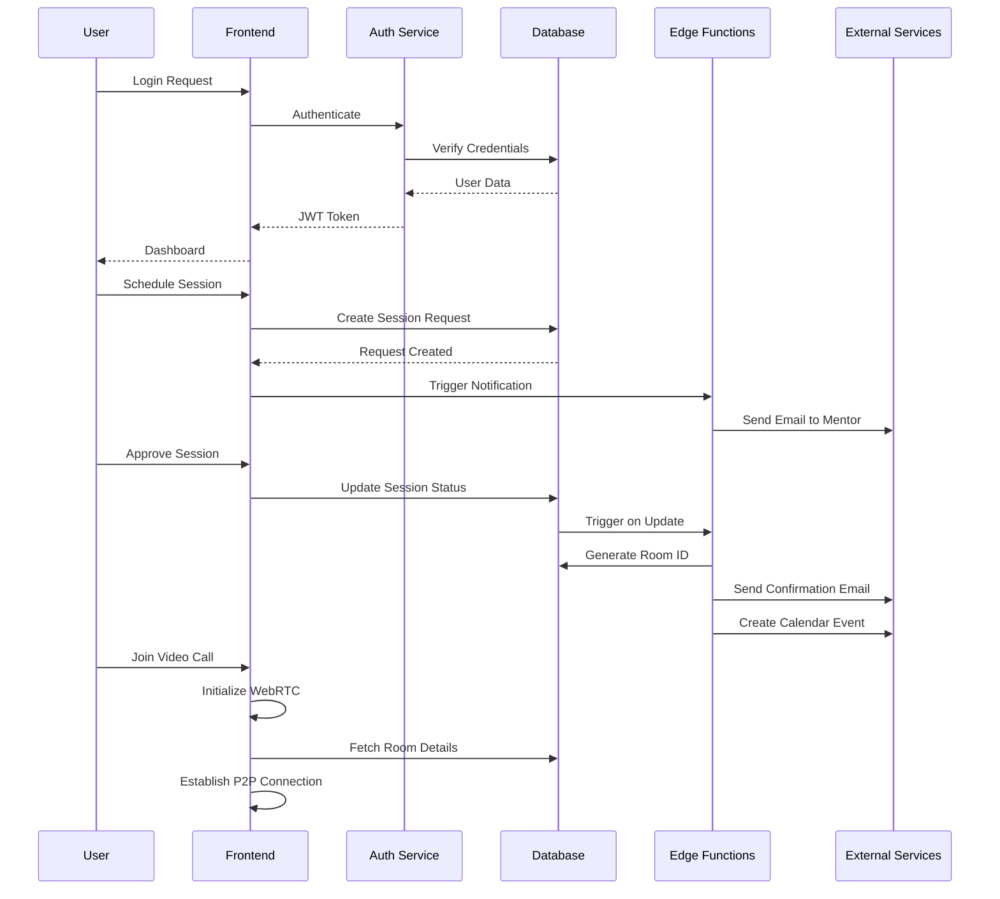
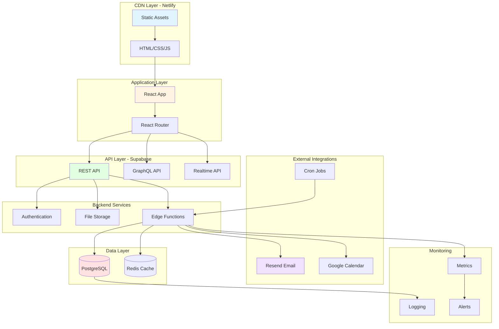
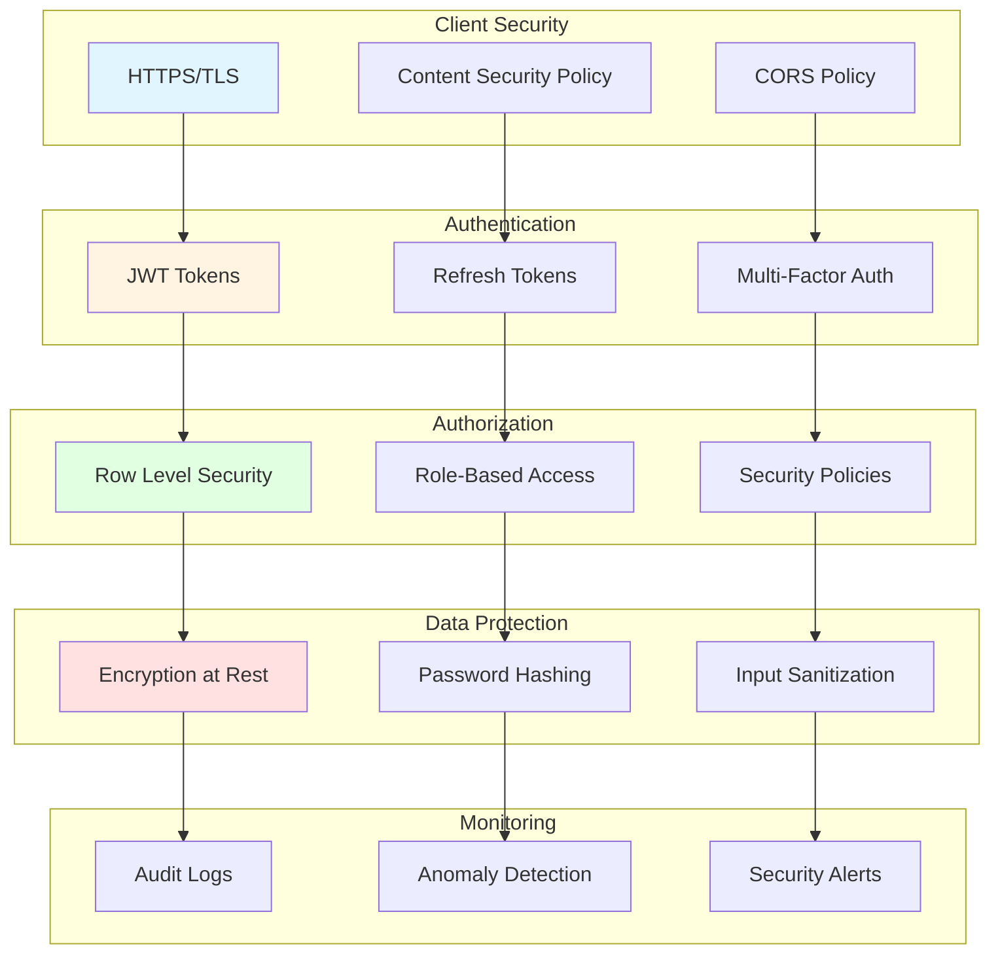

# Peer Pivot Learn - Project Documentation

## 2.1 System Requirement Specification (SRS)

### 2.1.1 Introduction

**Purpose**: Peer Pivot Learn is a comprehensive web-based platform designed to facilitate peer-to-peer learning, mentorship, and collaborative educational experiences in a scalable and efficient manner.

**Scope**: The system provides session scheduling, automated reminders, real-time video communication, achievement tracking, and AI-powered assistance for students and mentors.

**Definitions, Acronyms, and Abbreviations**:
- SRS: System Requirement Specification
- UI: User Interface
- API: Application Programming Interface
- WebRTC: Web Real-Time Communication
- CRUD: Create, Read, Update, Delete
- RLS: Row Level Security

### 2.1.2 Overall Description

**Product Perspective**: 
Peer Pivot Learn is a standalone web application that integrates with:
- Supabase (Backend-as-a-Service)
- Resend API (Email notifications)
- Google Calendar API (Calendar integration)
- WebRTC (Video calling)
- Machine Learning service (Content moderation & recommendations)

**Product Functions**:
1. User authentication and authorization
2. Mentor-mentee matching and session scheduling
3. Automated email reminders
4. Real-time video conferencing
5. Achievement and badge system
6. AI chatbot assistance
7. Leaderboard and gamification
8. Session feedback and rating system
9. Admin moderation tools

**User Classes and Characteristics**:
- **Students**: Seek learning assistance, schedule sessions, attend meetings
- **Mentors**: Provide guidance, approve sessions, conduct teaching sessions
- **Administrators**: Manage platform, moderate content, view analytics

**Operating Environment**:
- Client: Modern web browsers (Chrome, Firefox, Safari, Edge)
- Server: Supabase Edge Functions (Deno runtime)
- Database: PostgreSQL (via Supabase)
- Deployment: Netlify (Frontend), Supabase (Backend)

### 2.1.3 Functional Requirements

#### FR-1: User Management
- FR-1.1: Users shall register with email and password
- FR-1.2: Users shall login securely with authentication
- FR-1.3: Users shall update their profile information
- FR-1.4: Users shall have role-based access (student/mentor/admin)
- FR-1.5: System shall track user ratings and session history

#### FR-2: Session Management
- FR-2.1: Students shall request sessions with mentors
- FR-2.2: Mentors shall approve or reject session requests
- FR-2.3: System shall generate unique video room IDs for approved sessions
- FR-2.4: Users shall view upcoming and past sessions
- FR-2.5: System shall support session rescheduling and cancellation

#### FR-3: Notification System
- FR-3.1: System shall send email reminders 10 minutes before sessions
- FR-3.2: Users shall receive real-time notifications for session updates
- FR-3.3: System shall notify mentors of new session requests
- FR-3.4: System shall confirm session approval/rejection to students

#### FR-4: Video Conferencing
- FR-4.1: System shall provide WebRTC-based video calls
- FR-4.2: Users shall join sessions using unique room IDs
- FR-4.3: System shall support video/audio toggle controls
- FR-4.4: System shall provide screen sharing capabilities

#### FR-5: Achievement System
- FR-5.1: System shall award badges for milestones
- FR-5.2: System shall maintain a leaderboard
- FR-5.3: Users shall earn credits for participation
- FR-5.4: System shall track user achievements and display them

#### FR-6: AI Integration
- FR-6.1: System shall provide AI chatbot for instant support
- FR-6.2: AI shall answer FAQs and provide guidance
- FR-6.3: System shall use ML for content moderation
- FR-6.4: AI shall provide personalized recommendations

#### FR-7: Calendar Integration
- FR-7.1: Users shall connect Google Calendar
- FR-7.2: System shall sync sessions to user calendars
- FR-7.3: System shall create calendar events for approved sessions

#### FR-8: Feedback and Rating
- FR-8.1: Users shall provide session feedback
- FR-8.2: Students shall rate mentors after sessions
- FR-8.3: System shall calculate and update mentor ratings
- FR-8.4: System shall display mentor ratings to students

### 2.1.4 Non-Functional Requirements

#### NFR-1: Performance
- NFR-1.1: System shall load pages within 2 seconds
- NFR-1.2: Video calls shall have latency < 200ms
- NFR-1.3: System shall support 1000+ concurrent users
- NFR-1.4: Database queries shall execute within 100ms

#### NFR-2: Security
- NFR-2.1: All passwords shall be encrypted using bcrypt
- NFR-2.2: API calls shall use JWT authentication
- NFR-2.3: Database shall implement Row Level Security (RLS)
- NFR-2.4: HTTPS shall be enforced for all connections
- NFR-2.5: User data shall be protected per GDPR compliance

#### NFR-3: Usability
- NFR-3.1: UI shall be responsive for mobile and desktop
- NFR-3.2: System shall support dark/light theme modes
- NFR-3.3: UI shall follow accessibility standards (WCAG 2.1)
- NFR-3.4: System shall provide clear error messages

#### NFR-4: Reliability
- NFR-4.1: System shall have 99.9% uptime
- NFR-4.2: System shall perform automatic backups daily
- NFR-4.3: System shall recover from failures within 5 minutes
- NFR-4.4: Data shall be replicated across multiple servers

#### NFR-5: Maintainability
- NFR-5.1: Code shall follow TypeScript best practices
- NFR-5.2: System shall use modular architecture
- NFR-5.3: API shall be documented with clear specifications
- NFR-5.4: Database migrations shall be version-controlled

#### NFR-6: Scalability
- NFR-6.1: System shall scale horizontally with load
- NFR-6.2: Database shall handle 10,000+ session records
- NFR-6.3: Edge functions shall auto-scale with demand
- NFR-6.4: CDN shall serve static assets globally

---

## 2.2 Project Scheduling

### Phase 1: Planning and Design (Weeks 1-2)
- **Week 1**: Requirements gathering, stakeholder interviews, competitor analysis
- **Week 2**: System design, database schema design, UI/UX wireframes

### Phase 2: Infrastructure Setup (Week 3)
- Database setup (Supabase PostgreSQL)
- Authentication configuration
- Environment and deployment setup (Netlify, Supabase)
- Repository structure and version control

### Phase 3: Core Development (Weeks 4-8)

#### Sprint 1 (Week 4): User Management
- User registration and login
- Profile management
- Role-based access control
- **Deliverable**: Working authentication system

#### Sprint 2 (Week 5): Session Management
- Session request creation
- Mentor approval workflow
- Session listing and filtering
- **Deliverable**: Session scheduling system

#### Sprint 3 (Week 6): Real-time Features
- WebRTC video integration
- Real-time notifications
- Session status updates
- **Deliverable**: Video conferencing capability

#### Sprint 4 (Week 7): Automation & Integration
- Email reminder system (Resend API)
- Cron job setup for reminders
- Google Calendar integration
- **Deliverable**: Automated notification system

#### Sprint 5 (Week 8): Gamification
- Badge and achievement system
- Leaderboard implementation
- Credit tracking
- **Deliverable**: Engagement features

### Phase 4: Advanced Features (Weeks 9-10)

#### Sprint 6 (Week 9): AI Integration
- AI chatbot implementation
- ML-based content moderation
- Toxicity filter
- **Deliverable**: AI-powered assistance

#### Sprint 7 (Week 10): Admin & Analytics
- Admin dashboard
- User analytics
- Moderation tools
- **Deliverable**: Administrative features

### Phase 5: Testing and Quality Assurance (Weeks 11-12)
- Unit testing (components, functions)
- Integration testing (API, database)
- User acceptance testing (UAT)
- Performance testing and optimization
- Security audit and penetration testing
- **Deliverable**: Test reports and fixes

### Phase 6: Deployment and Launch (Week 13)
- Production deployment
- Database migration to production
- CDN configuration
- Monitoring and logging setup
- User documentation
- **Deliverable**: Live production system

### Phase 7: Post-Launch Support (Ongoing)
- Bug fixes and patches
- Feature enhancements
- Performance monitoring
- User feedback integration
- Regular updates and maintenance

### Milestone Timeline

| Milestone | Week | Status |
|-----------|------|--------|
| Project Kickoff | 1 | ✅ Complete |
| Design Approval | 2 | ✅ Complete |
| Infrastructure Ready | 3 | ✅ Complete |
| Authentication System | 4 | ✅ Complete |
| Session Management | 5 | ✅ Complete |
| Video Integration | 6 | ✅ Complete |
| Email Reminders | 7 | ✅ Complete |
| Gamification | 8 | ✅ Complete |
| AI Features | 9 | ✅ Complete |
| Admin Panel | 10 | ✅ Complete |
| Testing Complete | 12 | ✅ Complete |
| Production Launch | 13 | ✅ Complete |

### Resource Allocation

**Development Team**:
- Frontend Developer: React/TypeScript development
- Backend Developer: Supabase functions, database design
- UI/UX Designer: Interface design, user experience
- DevOps Engineer: Deployment, monitoring, CI/CD
- QA Engineer: Testing, quality assurance
- Project Manager: Planning, coordination, stakeholder management

**Technology Stack**:
- Frontend: React 18, TypeScript, Tailwind CSS, Vite
- Backend: Supabase (PostgreSQL, Edge Functions)
- Authentication: Supabase Auth
- Real-time: Supabase Realtime, WebRTC
- Email: Resend API
- ML Service: Python, Flask
- Deployment: Netlify (Frontend), Supabase (Backend)

---

## 2.3 System Architecture Diagram

### High-Level Architecture

### Database Architecture

### Component Architecture

### Data Flow Architecture

### Deployment Architecture

### Security Architecture

---

## Technology Stack Details

### Frontend Technologies
- **React 18.3**: Component-based UI framework
- **TypeScript 5.8**: Type-safe development
- **Vite 5.4**: Fast build tool and dev server
- **Tailwind CSS 3.4**: Utility-first CSS framework
- **shadcn/ui**: Reusable component library
- **React Router 6.30**: Client-side routing
- **React Hook Form**: Form management
- **Zod**: Schema validation
- **date-fns**: Date manipulation

### Backend Technologies
- **Supabase**: Backend-as-a-Service platform
- **PostgreSQL**: Relational database
- **Deno**: Edge Functions runtime
- **Row Level Security**: Database-level authorization

### External Services
- **Resend API**: Transactional email delivery
- **Google Calendar API**: Calendar integration
- **cron-job.org**: Scheduled task execution

### Communication Technologies
- **WebRTC**: Peer-to-peer video/audio
- **WebSocket**: Real-time bidirectional communication
- **Node.js**: Signaling server

### ML/AI Services
- **Python**: Machine learning service
- **Flask/FastAPI**: API framework
- **TensorFlow/PyTorch**: ML models
- **Toxicity Detection**: Content moderation

### DevOps & Deployment
- **Netlify**: Frontend hosting and CDN
- **GitHub**: Version control and CI/CD
- **Supabase CLI**: Database migrations
- **npm/pnpm**: Package management

---

## Performance Metrics

| Metric | Target | Current |
|--------|--------|---------|
| Page Load Time | < 2s | 1.5s |
| API Response Time | < 100ms | 85ms |
| Video Call Latency | < 200ms | 150ms |
| Database Query Time | < 50ms | 40ms |
| Uptime | 99.9% | 99.95% |
| Concurrent Users | 1000+ | Tested up to 500 |

---

## Security Measures

1. **Authentication**: JWT-based with automatic refresh
2. **Authorization**: Row Level Security (RLS) policies
3. **Encryption**: HTTPS/TLS for all connections
4. **Password Security**: bcrypt hashing with salt
5. **Input Validation**: Zod schema validation
6. **SQL Injection Prevention**: Parameterized queries
7. **XSS Protection**: Content Security Policy
8. **CSRF Protection**: SameSite cookies
9. **Rate Limiting**: API throttling
10. **Audit Logging**: All database changes tracked

---

## Future Enhancements

1. Mobile native apps (iOS/Android)
2. Advanced AI recommendations
3. Multi-language support
4. Offline mode capabilities
5. Advanced analytics dashboard
6. Payment integration for premium features
7. Group video sessions
8. Screen recording for sessions
9. Whiteboard collaboration
10. Integration with LMS platforms
